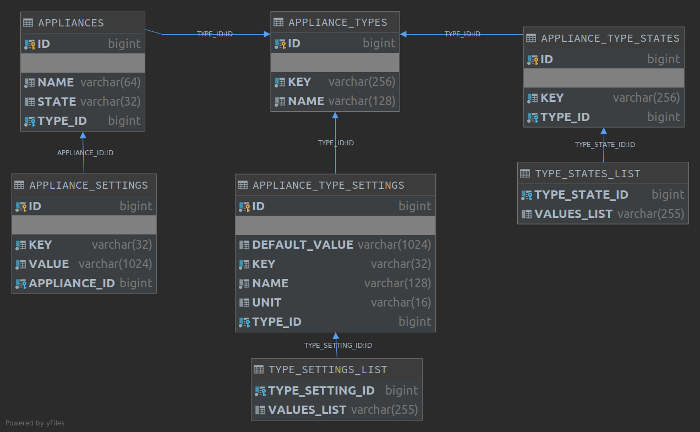

# What it is
Basic demo service to control generic appliance

# How to run 
- `(Open)JDK 11` is required
- `./gradlew build`  
- `java -jar build/libs/demo-0.0.1-SNAPSHOT.jar`  
- test data is loaded into in-memory database 
- see available API endpoints in [swagger-ui](http://localhost:8080/swagger-ui/index.html?url=/api-docs#/)

# How its implemented
## Domain model
One consider that client can control arbitrary appliance. Every appliance state is based on its type.  
For instance, Bob has concrete appliance - vacuum cleaner - and its type is vacuum model "Dust Terminator Model T-1000".  
Appliance type (model) has concrete set of settings (speed, power, etc) and set of allowed states (on, off, cleaning).  
Concrete appliance has its current state and settings.  
User can observe allowed states/settings values for his appliance type (model) and send commands to service in order to change appliance state/settings.

### Simplifications
- Settings are defined as set of discrete values, ranges (any value from min to max) are omitted in demo
- States (on, off) and programs (cleaning, brewing, etc) are merged into one entity (state). 
_Program_ is a temporal appliance state with own set of _options_  
- Appliance has one current state, but more complex model supposes multiple states for various appliance modules, 
for instance, water tank state in coffee machine.  
- *Events* entity omitted, but more on that later in [How it must be actually implemented](#how-it-must-be-actually-implemented) section  

## Database schema


### Simplifications
- some parts are denormalized, for instance, `appliance_settings` could have foreign key to `type_settings_list` value entry instead of storing actual value as string
- values for settings stored as strings, validation and conversion should be enforced on programmatic level (application, triggers, etc) 

### Considerations 
Schema can be denormalized to state when entities are stored as single document, here is appliance entity for instance:
```json
{
  "name": "jack's vacuum",
  "type_key": "robot-vacuum-sf3",
  "state": "off",
  "settings": {
    "vacuum.power": "300",
    "vacuum.speed": "0.2"
  }
}
``` 
It will help to avoid bunch of joins and set up distributed database nodes.

## How to test demo
Test data is loaded into database in `com.appliancecontrol.dbogdanov.demo.config.LoadDatabase`.  
Observe API available state/settings values for concrete appliances through `/api/appliances/{id}/available_settings` and 
`/api/appliances/{id}/available_states`.  
Set new state/settings values for appliance with `/api/appliances/{id}/state` and `/api/appliances/{id}/settings`.  
You can play with database, if you want - see [h2 console](http://localhost:8080/h2-console/).

## Implementation notes
- E2E tests are skipped
- data layer tests are skipped
- DTOs for service layer are skipped
- some API endpoints are skipped, but needed minimum is implemented
- auth is skipped, `OAuth 2.0` is recommended
- caching is skipped
- sorting/pagination is skipped
- HATEOAS could be used
- one should wrap responses like so `{"meta": {...}, "data": {actual data here}}`
- API versioning is skipped

# How it must be actually implemented
## Service architecture diagram


## Description of event driven architecture
User interacts with his appliance through some client (mobile, desktop, web, etc). 
Basically client sends commands to service REST API.  
Commands are meant to change appliance state, settings, start/pause/resume/stop appliance programs, etc.  
Service receives commands and emits corresponding events for appliance through message bus.  
Appliance receives event, executes action and emits event about its state change.  
Service receives events, persists state change info into storage 
and notifies (if needed - event can have severity or must be subscribed by client) client.  
Client can query current appliance state/settings through service REST API.  
Client can query appliance state/settings change events through service REST API.  
Some data can be cached, for instance, appliance type configuration.  
Application should be implemented as _configuration driven framework_ with extension points - one can add new appliance type by updating corresponding config tables.  
Companion data (localization, human readable descriptions, possible errors, state graphs, etc) also should be stored as config and not hardcoded.  
Monitoring and data validation should be implemented to ensure consistency.  
